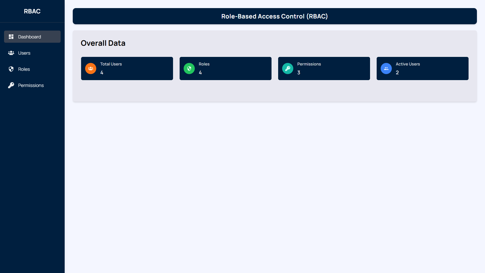
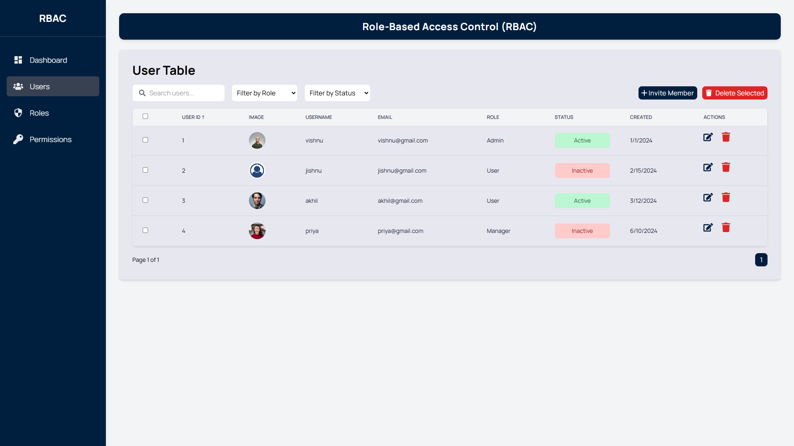
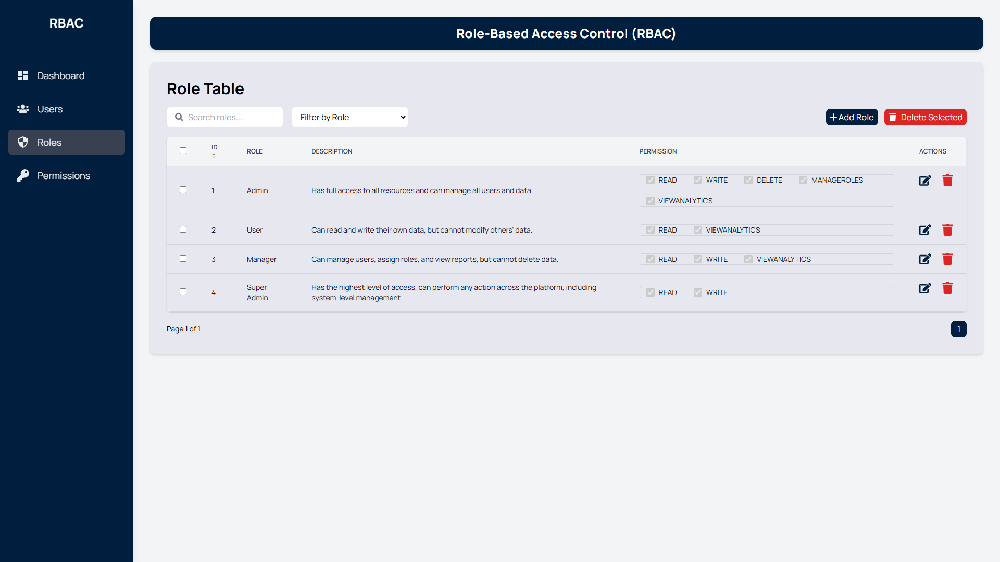
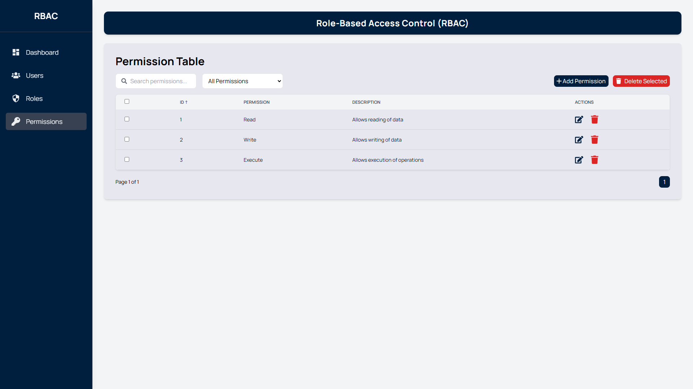

# **Role-Based Access Control (RBAC) UI**

This project is a Role-Based Access Control (RBAC) User Interface designed and developed by Rajendra Kumar, IIT Mandi, as part of the VRV Security Frontend Developer Intern assignment. The application delivers a user-friendly and secure platform for managing users, roles, and permissions. Leveraging modern web technologies, it emphasizes creativity, functionality, and an exceptional user experience.


## **Table of Contents**

1. [Project Overview](#project-overview)
2. [Features](#features)
3. [Additional Features](#additional-features)
4. [Technology Stack](#technology-stack)
5. [Setup Instructions](#setup-instructions)
6. [Screenshots](#screenshots)

---

## **Project Overview**

The RBAC UI empowers administrators to seamlessly manage key operations, including user, role, and permission management. With a focus on clean design and dynamic animations, the application ensures a responsive and engaging experience across all devices.

### **Core Requirements Addressed:**

- **User Management**: Add, edit, delete, and assign roles to users.
- **Role Management**: Define roles and manage associated permissions.
- **Dynamic Permissions**: Assign permissions dynamically to roles.
- **Smooth animations** using **Framer Motion** for a modern UI experience.

---

## **Features**

### **User Management**

- Display user information in an organized, responsive table.
- Perform dynamic operations like adding, editing, or deleting users.
- Assign roles and update user statuses (e.g., Active/Inactive).

### **Role Management**

- Create, edit, or delete roles.
- Manage permissions for roles dynamically.
- Display permissions in an intuitive UI.

### **Permission Handling**

- Assign, remove, and customize permissions for specific roles.
- Modular permission categories (e.g., Read, Write, Delete).

### **UI/UX**

- Responsive design using **Tailwind CSS** for a seamless experience across all devices.
- Animations powered by **Framer Motion** for smooth transitions and user feedback.

---

## **Additional Features**

Here are some planned features that can further improve the application:

- **Sorting and Filtering**: Add sorting and filtering for users, roles, and permissions.
- **Search Functionality**: Global search for easier navigation.
- **Audit Logs**: Track changes to roles, users, and permissions.
- **Pagination**: Implement pagination to improve the handling of large datasets, making navigation easier when viewing long lists of users, roles, and permissions.
- **Multiple Select to Delete**: Allow administrators to select multiple users, roles, or permissions at once and delete them in bulk for better management.

---

## **Technology Stack**

- **Frontend Framework**: [React](https://reactjs.org/) with [Vite](https://vitejs.dev/) for fast development.
- **Styling**: [Tailwind CSS](https://tailwindcss.com/) for modern and responsive UI.
- **Animations**: [Framer Motion](https://www.framer.com/motion/) for dynamic and smooth animations.
- **Hosting**: [Vercel](https://vercel.com/) for fast and reliable deployment.
- **Icons**: React Icons for a clean visual design.

---

## **Setup Instructions**

To run the project locally, follow these steps:

### **Prerequisites**

- Node.js installed (v16+)
- Git installed

### **Installation**

1. Clone the repository:

   ```bash
   git clone https://github.com/vishnukkrishna/RBAC-VRV-Security.git
   cd RBAC-VRV-Security

   ```

2. Install dependencies:

   ```bash
   npm install

   ```

3. Start the development server:

   ```bash
   npm run dev

   ```

4. Open your browser and navigate to:
   ```bash
   http://localhost:5173
   ```

## **Live Demo**:

**The application is live and can be accessed here**:

[**RBAC UI Live**](https://rbac-vrv-security.vercel.app)

## **Screenshots**

### Dashboard



### User Management



### Role Management



### Permission Management


# RBAC_VRV_SECURITY
